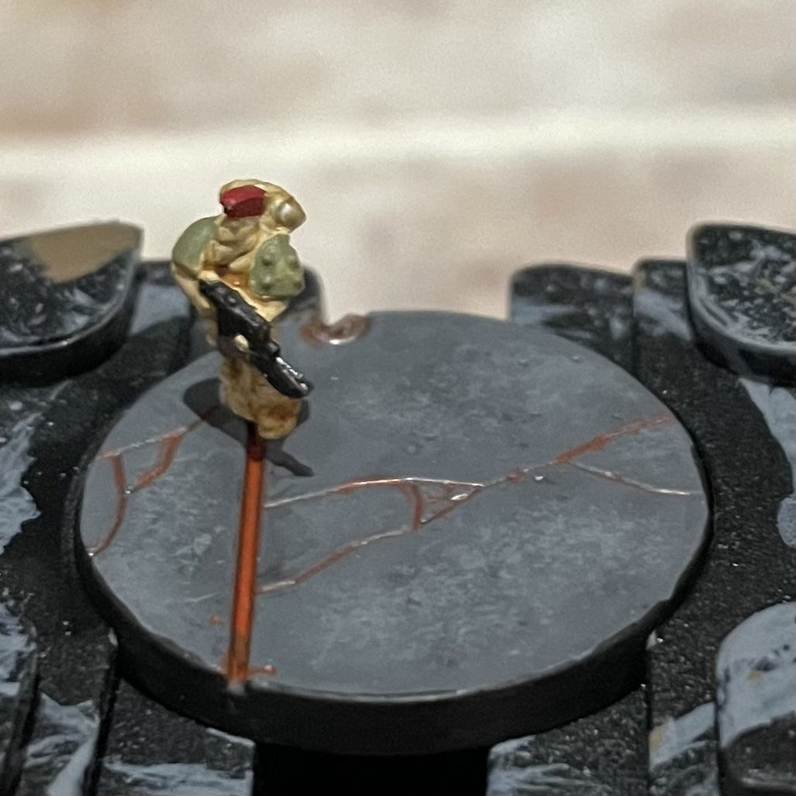

Started working on Horus Heresy Legions Imperalis box set recently, for Death Guard.

Formula I found for bases is:

- base: Vallejo Model Color Neutral Grey or Citadel Mechanicus Standard Grey
- all over wash: Citadel Contract Basilicanum Grey, thinned with 2 parts water/contrast medium
- highlight: Dry stiple with Dawnstone
- recess wash: Liquitex Professional Acrylic Ink Red Oxide, just to the recesses/panels
- rim: color in the base rim with some sort of black, Abaddon Black, Black Legion

